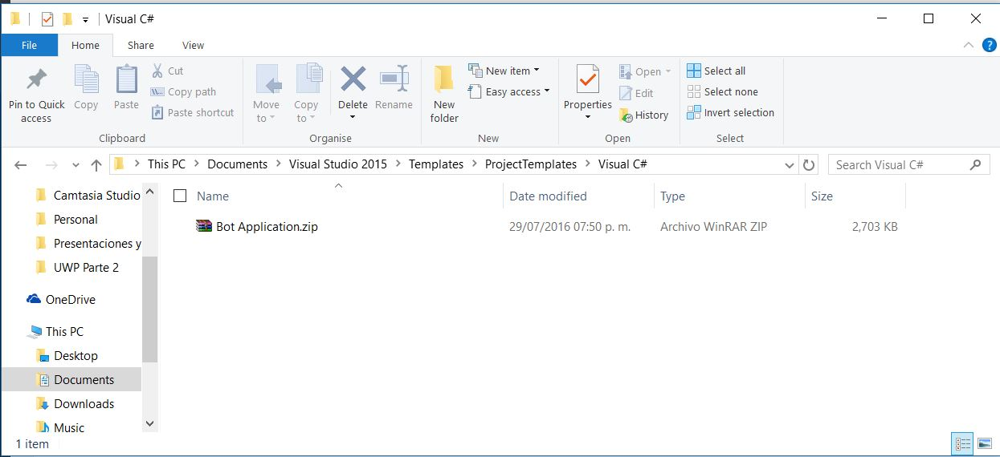
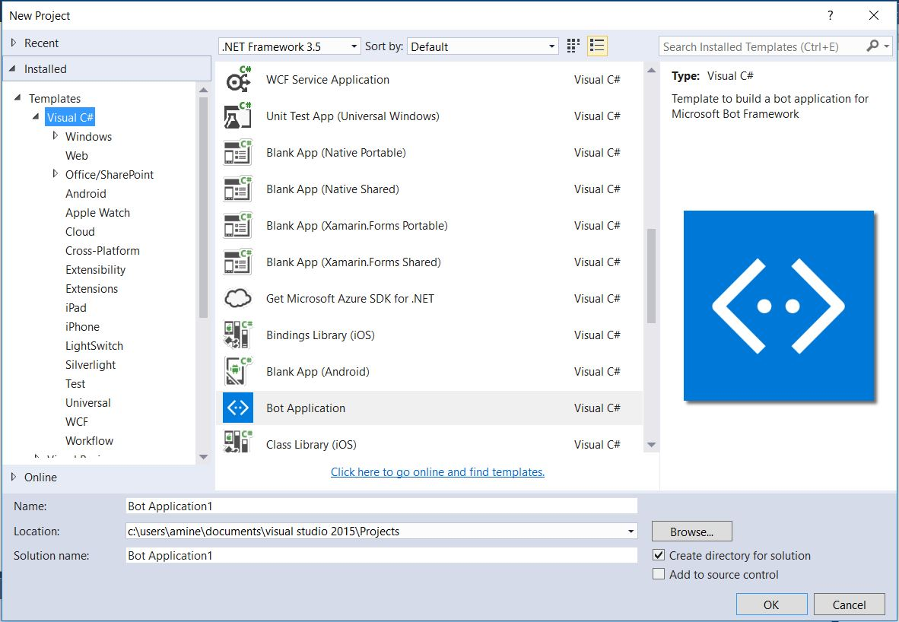
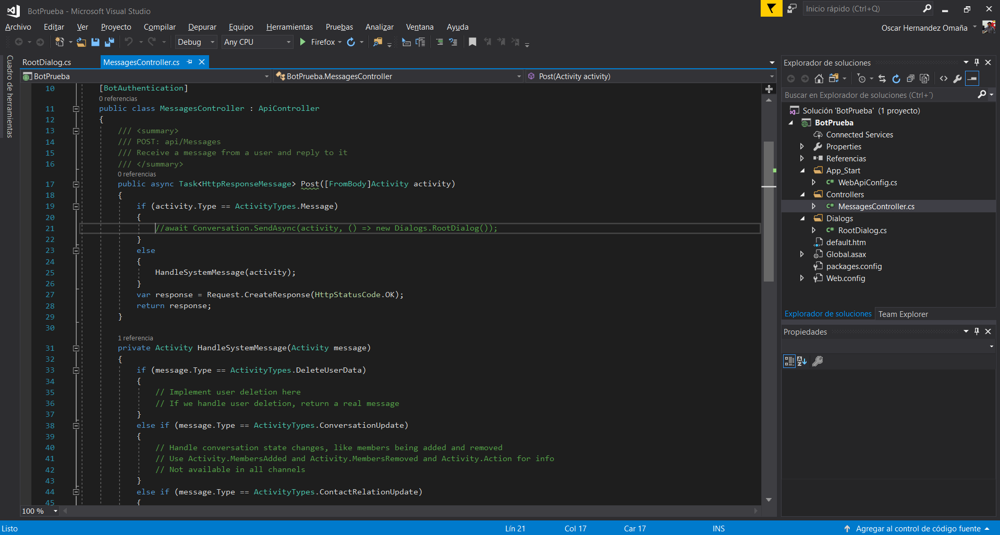
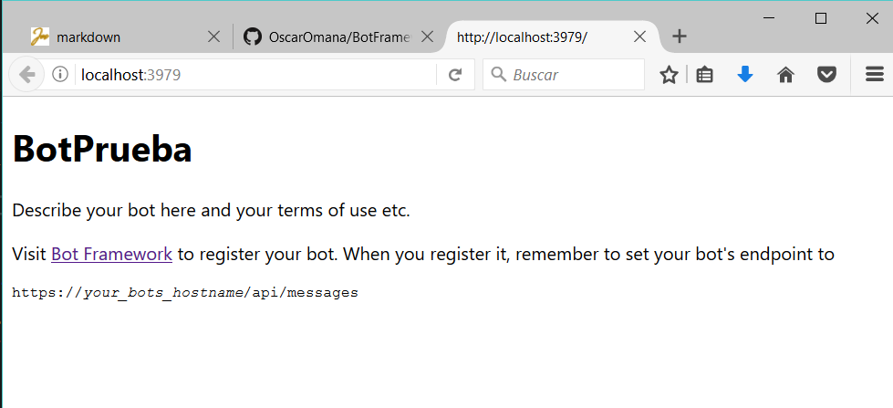
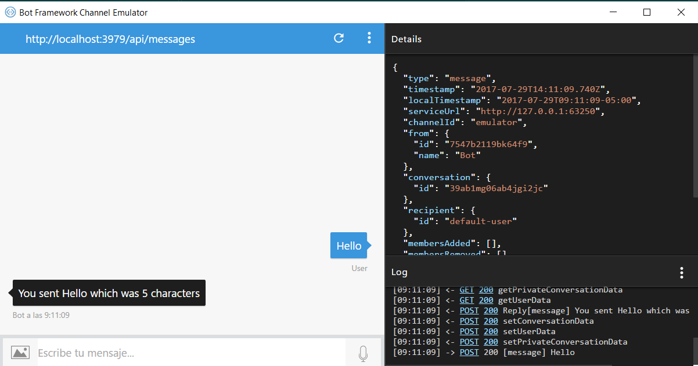
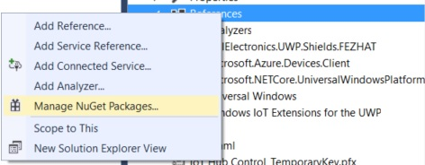
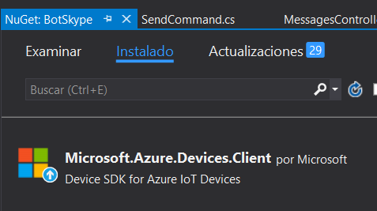
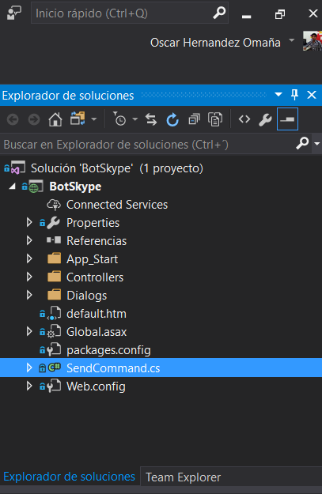
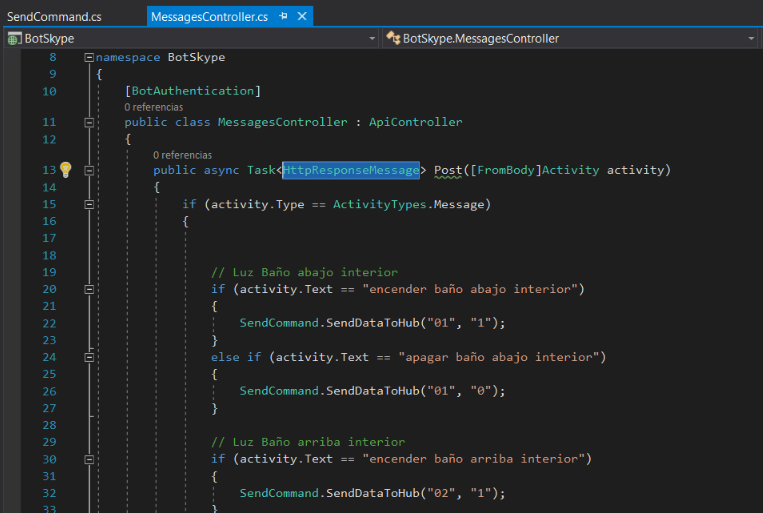

#  Microsoft Bot Framework
Con este proyecto pretendemos encender las luces de la casa mediante el uso de Microsoft Bot Framework.

Pero antes de pasar a lo interesante veamos cómo es que  Microsoft Bot Framework es una de esas herramientas sumamente fáciles de configurar y con un potencial para implementar en mil cosas. 

Así que comencemos por descargar lo necesario para este proyecto.

* Descarga una plantilla de Visual Studio para comenzar a crear tu propio Bot desde [aquí.](http://aka.ms/bf-bc-vstemplate)
* Descarga el emulador de bots que podrá funcionar para hacer tus pruebas desde [aquí.](https://github.com/Microsoft/BotFramework-Emulator/releases/download/v3.5.31/botframework-emulator-Setup-3.5.31.exe
)

## Paso 1:
Ya que tengas descargado del primer enlace el archivo .zip llamado Bot Framework lo debes colocar en las plantillas de C# para desarrollo, esto es: ..\Documents\Visual Studio 2015\Templates\ProjectTemplates\Visual C#

Ya en la posición adecuada, al abrir Visual Studio podrás ver la plantilla de proyecto disponible para crear el primero de este tipo.

Con el proyecto creado no tendrás grandes complicaciones, todo reside esencialmente en MessageController.cs, de hecho viene un ejercicio simple en el que nos apoyaremos en esta ocasión para mostrar el primer ejemplo.

Solo presiona F5 y listo. Tendrás tu proyecto compilado. Simple ¿no?

## Paso 2:
Abre el emulador que ya debiste haber obtenido de tu segundo enlace y claro, instalado. Una vez abierto, necesitarás algunos datos.

La URL del bot: http ://localhost:3979/api/messages

Por ahora omite los dos campos en blanco.

Ya configurado, comienza a jugar. Escribe cualquier palabra y el bot te dirá qué escribiste y cuántos caracteres has consumido.

# Ahora si viene lo divertido!!
Vamos a agregar lo necesario para que nuestro proyecto se pueda comunicar a Microsoft Azure por medio de un IOT Hub

El IOT Hub ya debe de estar creado previamente, si no sabes cómo hacerlo puedes verlo en este [enlace.](https://github.com/aminespinoza/Ejercicio-Comunicacion-Raspberry-Pi-con-IoT-Hub)

Con tu IOT Hub creado prepárate para sorprenderte de lo sumamente fácil que es prender las luces mediante un bot.

Para comenzar vamos a agregar un paquetes de Nuget para utilizar en la solución.

Búscalo como aparece en la imagen.

Ahora agrega una nueva clase al proyecto, en mi caso la llamare “SendCommand” 

Vamos a crear un método asíncrono público para enviar la información al hub y le vamos a pasar dos parámetros

~~~
public static async void SendDataToHub(string light, string handler)
        {

        }
~~~

Declaramos nuestras variables globales 
~~~
            DeviceClient deviceClient;
            string iotHubUri = "tu Uri";
            string deviceKey = "tu key";
            string deviceId = "tu device ID";
~~~

Como puedes ver se trata de todos los objetos que vamos a utilizar durante la aplicación, el valor DeviceClient es el que hará toda la comunicación con el IoT Hub, aquí es donde debes copiar los valores de tu dispositivo IoT creado desde tu Device Explorer. puedes guiarte con este [enlace.](https://github.com/aminespinoza/Ejercicio-Comunicacion-Raspberry-Pi-con-IoT-Hub)

Ahora sigue el registro de nuestro cliente, para eso usamos esta línea 
~~~
           deviceClient = DeviceClient.Create(iotHubUri, new DeviceAuthenticationWithRegistrySymmetricKey(deviceId, deviceKey));
~~~
Englobamos los datos que enviaremos al hub en una variable, en mi caso telemetryDataPoint lo serializamos y encriptamos 
~~~

            var telemetryDataPoint = new
            {
                lightNumber = light,
                lightStatus = handler,
                date = DateTime.Now
            };
       
            var messageString = JsonConvert.SerializeObject(telemetryDataPoint);
            var message = new Message(Encoding.ASCII.GetBytes(messageString));
~~~
Ahora solo enviamos la información al hub
~~~
            await deviceClient.SendEventAsync(message);
~~~
Y por último, sí por ULTIMO, en la clase MessagesController dentro de HttpResponseMessage, bastara con agregar algunos if else y hacer referencia a la clase SendCommand justo como se ve en la imagen. 

Creo que no hay mucho que explicar aquí.

Y Listo!!! Ya solo resta probar y disfrutar de prender tus luces con un bot de Skype.

Podrás ver el funcionamiento en este [video](https://www.youtube.com/watch?v=0EESajuSL78) 

la otra parte del proyecto la encuentras en este [enlace.](https://github.com/aminespinoza/Ejercicio-Comunicacion-Raspberry-Pi-con-IoT-Hub)
