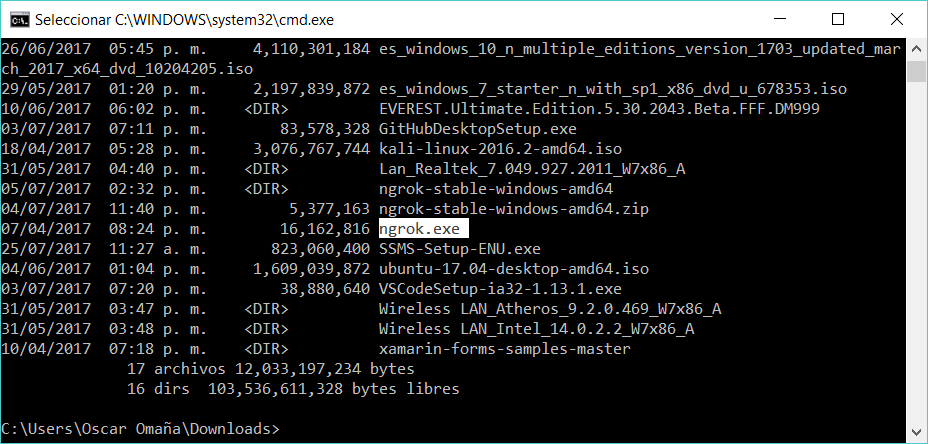
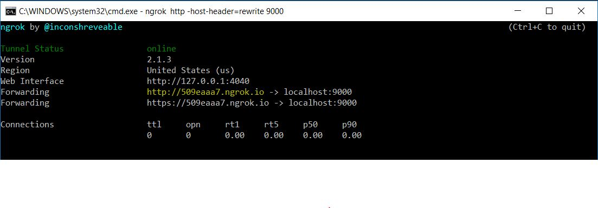
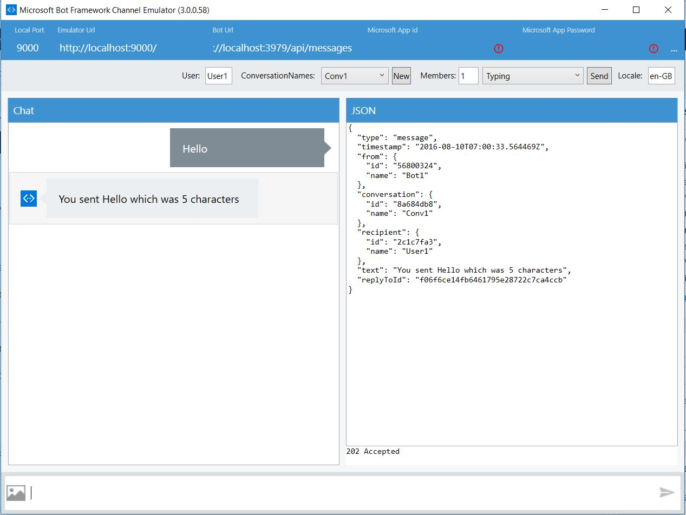

#  Microsoft Bot Framework
Con este proyecto pretendemos encender las luces de la casa mediante el uso de Microsoft Bot Framework.

Pero antes de pasar a lo interesante veamos cómo es que  Microsoft Bot Framework es una de esas herramientas sumamente fáciles de configurar y con un potencial para implementar en mil cosas. 

Así que comencemos por descargar lo necesario para este proyecto.

* Descarga una plantilla de Visual Studio para comenzar a crear tu propio Bot desde [aquí.](http://aka.ms/bf-bc-vstemplate)
* Descarga el emulador de bots que podrá funcionar para hacer tus pruebas desde [aquí.](https://github.com/Microsoft/BotFramework-Emulator#download
)
* Descarga un cliente de [ngrok.](https://ngrok.com/download) 

## Paso 1:
Ya que tengas descargado del primer enlace el archivo .zip llamado Bot Framework lo debes colocar en las plantillas de C# para desarrollo, esto es: ..\Documents\Visual Studio 2015\Templates\ProjectTemplates\Visual C#

Ya en la posición adecuada, al abrir Visual Studio podrás ver la plantilla de proyecto disponible para crear el primero de este tipo.

Con el proyecto creado no tendrás grandes complicaciones, todo reside esencialmente en MessageController.cs, de hecho viene un ejercicio simple en el que nos apoyaremos en esta ocasión para mostrar el primer ejemplo.

Solo presiona F5 y listo. Tendrás tu proyecto compilado. Simple ¿no?

## Paso 2:
Ahora abre una terminal de comandos y dirígete a donde esté el archivo ejecutable que descargaste del tercer enlace.

 
Ya estando ubicado ahí, escribe el siguiente comando: ngrok http -host-header=rewrite 9000

Este comando te permite la posibilidad de abrir un puerto (o varios) a tu localhost, de hecho específicamente abrirás el puerto 9000 que es el que requieres para poder hacer pruebas con tu bot local. Una vez ejecutado el comando, el resultado de tu terminal será algo como esto.

 ¿Ves el texto en amarillo? Necesitarás copiar este enlace que será el puente que establecerá la comunicación local con tu bot.

## Paso 3:
Abre el emulador que ya debiste haber obtenido de tu segundo enlace y claro, instalado. Una vez abierto, necesitarás algunos datos.

La URL del emulador: http ://509eaaa7.ngrok.io (es la obtenida gracias a ngrok).

La URL del bot: http ://localhost:3979/api/messages

Por ahora omite los dos campos en blanco.

Ya configurado, comienza a jugar. Escribe cualquier palabra y el bot te dirá qué escribiste y cuántos caracteres has consumido.

!

# Ahora si viene lo divertido!!
Vamos a agregar lo necesario para que nuestro proyecto se pueda comunicar a Microsoft Azure por medio de un IOT Hub

 Para esto vamos a modificar muy poco el proyecto que ya enciende las luces por medio del teléfono. Puedes descargar el proyecto desde este [enlace.](https://github.com/aminespinoza/Proyecto-Miranda/tree/master/Software)
 